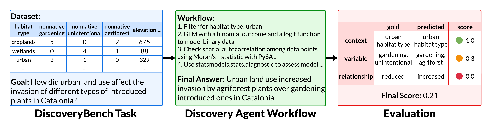

<p align="center">
  <a href="[https://github.com/princeton-nlp/Llamao](https://github.com/allenai/discoverybench)">
    
  </a>
</p>

  
---

Dataset and code for ["DiscoveryBench: Towards Data-Driven Discovery with Large Language Models"](#)

---

## 👋 Overview

DiscoveryBench is designed to systematically assess current model capabilities in data-driven discovery tasks and provide a useful resource for improving them. Each DiscoveryBench task consists of a goal and dataset(s). Solving the task requires both statistical analysis and semantic reasoning. A faceted evaluation allows open-ended final answers to be rigorously evaluated.

<p align="center">
  <a href="[https://github.com/princeton-nlp/Llamao](https://github.com/allenai/discoverybench)">
    
  </a>
</p>


This repo is structured as follows:

- **DiscoveryBench**: Contains both real and synthetic datasets, located in the `discoverybench` folder.
- **Discovery Agents**: Includes the code for discovery agents, found in the `agents` folder and can be instantiated using `discovery_agent.py`.
- **Evaluation System**: Evaluation scripts are stored in the `eval` folder, accessible via `discovery_eval.py`.

---

## 🚀 Running Discovery Agents

To run the discovery agents use the `discovery_agent.py` script as following:

```
Usage: discovery_agent.py [OPTIONS] QUERY

Options:
  --agent_type [coder|react]    Agent type to use for discovery, default is
                                coder
  --model_name TEXT             Model name, default is gpt-4o, available
                                models are [gpt-4-turbo|llama-3-70b-chat|claud
                                e-3-opus|gemini-pro]. Exhaustive list can be
                                found in config/model_config.json
  --api_config TEXT             API config file, default is
                                config/api_config.json
  --log_file TEXT               Log file
  --metadata_path TEXT          Metadata file path  [required]
  --metadata_type [real|synth]  Metadata type  [required]
  --add_domain_knowledge        Add domain knowledge to query
  --add_workflow_tags           Add Workflow Tags to query
  --help                        Show this message and exit.
```

## ⚖️ Evaluating Discovery Agents

To evaluate the outputs generated by the discovery agents, use the `discovery_eval.py` script as following:

```
Usage: discovery_eval.py [OPTIONS] QUERY

Options:
  --gold_hypo TEXT              Gold Hypothesis  [required]
  --gold_workflow TEXT          Gold Workflow
  --pred_hypo TEXT              Predicted Hypothesis  [required]
  --pred_workflow TEXT          Predicted Workflow
  --metadata_path TEXT          Metadata file path  [required]
  --metadata_type [real|synth]  Metadata type  [required]
  --eval_output_path TEXT       Evaluation output path
  --help                        Show this message and exit.
```

## Contribution 

TBA on how users can contribute to agents. 

## ✍️ Citation
If you find our work helpful, please use the following citations.
```
@inproceedings{
TBA
}
```

